# 📋 Documentación Técnica Completa

## Sistema de Evaluación de Candidatos con LangChain

> **Versión**: 2.1.0  
> **Última actualización**: Diciembre 2024  
> **Stack principal**: Python 3.9+ | LangChain | LangGraph | FAISS | Streamlit

---

## 📑 Índice

1. [Resumen Ejecutivo](#1-resumen-ejecutivo)
2. [Arquitectura Técnica del Sistema](#2-arquitectura-técnica-del-sistema)
3. [Stack Tecnológico](#3-stack-tecnológico)
4. [Patrones de Diseño Implementados](#4-patrones-de-diseño-implementados)
5. [Diagramas Técnicos](#5-diagramas-técnicos)
6. [LangChain como Pilar Tecnológico](#6-langchain-como-pilar-tecnológico)
7. [Sistema RAG Conversacional](#7-sistema-rag-conversacional)
8. [Funcionalidades Premium Opcionales](#8-funcionalidades-premium-opcionales)
9. [Pipeline de Procesamiento](#9-pipeline-de-procesamiento)
10. [Arquitectura de Código](#10-arquitectura-de-código)
11. [Sistema de Logging Operacional](#11-sistema-de-logging-operacional)
12. [Gestión de Configuraciones](#12-gestión-de-configuraciones)
13. [Estrategias de Escalabilidad](#13-estrategias-de-escalabilidad)
14. [Guía de Despliegue](#14-guía-de-despliegue)
15. [Métricas y Observabilidad](#15-métricas-y-observabilidad)

---

## 1. Resumen Ejecutivo

### 1.1 ¿Qué es este sistema?

El **Sistema de Evaluación de Candidatos** es una solución empresarial de Inteligencia Artificial que automatiza el proceso de evaluación de candidatos contra ofertas de empleo. Utiliza las capacidades más avanzadas de **LangChain** para garantizar evaluaciones precisas, trazables y escalables.

### 1.2 Propuesta de Valor

| Para Stakeholders | Beneficio |
|-------------------|-----------|
| **Reclutadores** | Reduce tiempo de evaluación de 6-7 minutos a 30-60 segundos por candidato |
| **Managers** | Criterios objetivos y consistentes eliminan sesgo humano |
| **Candidatos** | Evaluación justa basada en evidencia documentada |
| **IT/DevOps** | Arquitectura modular, escalable y observable |

### 1.3 Capacidades Principales

```
┌─────────────────────────────────────────────────────────────────────────┐
│                    CAPACIDADES DEL SISTEMA                               │
├─────────────────────────────────────────────────────────────────────────┤
│                                                                          │
│  🎯 CORE                        🚀 PREMIUM (OPCIONAL)                    │
│  ─────────────────              ───────────────────────                  │
│  ✓ Extracción de requisitos    ✓ LangGraph Multi-Agente                │
│  ✓ Matching CV-Requisitos      ✓ Embeddings Semánticos FAISS           │
│  ✓ Entrevista interactiva      ✓ RAG para Historial                    │
│  ✓ Multi-proveedor LLM         ✓ LangSmith Trazabilidad                │
│  ✓ Niveles de confianza        ✓ Streaming en tiempo real              │
│  ✓ Persistencia de historial   ✓ Logging operacional                   │
│                                                                          │
└─────────────────────────────────────────────────────────────────────────┘
```

---

## 2. Arquitectura Técnica del Sistema

### 2.1 Visión General de Capas

El sistema implementa una **arquitectura por capas** que separa claramente las responsabilidades:

```
┌─────────────────────────────────────────────────────────────────────────┐
│                         CAPA DE PRESENTACIÓN                             │
│                         (Streamlit UI)                                   │
├─────────────────────────────────────────────────────────────────────────┤
│                                                                          │
│  ┌─────────────────┐  ┌─────────────────┐  ┌─────────────────┐         │
│  │   Nueva         │  │   Historial     │  │   Opciones      │         │
│  │   Evaluación    │  │   + RAG Chat    │  │   Avanzadas     │         │
│  └─────────────────┘  └─────────────────┘  └─────────────────┘         │
│                                                                          │
├─────────────────────────────────────────────────────────────────────────┤
│                         CAPA DE ORQUESTACIÓN                             │
│                         (CandidateEvaluator)                             │
├─────────────────────────────────────────────────────────────────────────┤
│                                                                          │
│  ┌───────────────────────────────┐  ┌───────────────────────────────┐  │
│  │         FASE 1               │  │         FASE 2               │  │
│  │    Phase1Analyzer            │  │    Phase2Interviewer         │  │
│  │    ┌─────────────────────┐   │  │    ┌─────────────────────┐   │  │
│  │    │ LangGraph (opcional)│   │  │    │ Generación preguntas│   │  │
│  │    │ Embeddings (opcional)│   │  │    │ Evaluación respuesta│   │  │
│  │    └─────────────────────┘   │  │    └─────────────────────┘   │  │
│  └───────────────────────────────┘  └───────────────────────────────┘  │
│                                                                          │
├─────────────────────────────────────────────────────────────────────────┤
│                         CAPA DE SERVICIOS                                │
├─────────────────────────────────────────────────────────────────────────┤
│                                                                          │
│  ┌──────────────┐  ┌──────────────┐  ┌──────────────┐  ┌─────────────┐ │
│  │  LLMFactory  │  │ SemanticMatch│  │  RAG/Vector  │  │  UserMemory │ │
│  │  (LLMs)      │  │  (FAISS)     │  │  (Historial) │  │  (Storage)  │ │
│  └──────────────┘  └──────────────┘  └──────────────┘  └─────────────┘ │
│                                                                          │
├─────────────────────────────────────────────────────────────────────────┤
│                         CAPA DE INFRAESTRUCTURA                          │
├─────────────────────────────────────────────────────────────────────────┤
│                                                                          │
│  ┌──────────────┐  ┌──────────────┐  ┌──────────────┐  ┌─────────────┐ │
│  │   OpenAI     │  │   Google     │  │  Anthropic   │  │  LangSmith  │ │
│  │   API        │  │   Gemini     │  │   Claude     │  │  Tracing    │ │
│  └──────────────┘  └──────────────┘  └──────────────┘  └─────────────┘ │
│                                                                          │
└─────────────────────────────────────────────────────────────────────────┘
```

### 2.2 Componentes Principales

| Componente | Ubicación | Responsabilidad |
|------------|-----------|-----------------|
| **CandidateEvaluator** | `core/evaluator.py` | Orquestador principal que coordina las fases |
| **Phase1Analyzer** | `core/analyzer.py` | Extracción de requisitos y matching con CV |
| **Phase2Interviewer** | `core/interviewer.py` | Generación de preguntas y evaluación de respuestas |
| **SemanticMatcher** | `core/embeddings.py` | Búsqueda de evidencia semántica con FAISS |
| **LangGraph** | `core/graph.py` | Orquestación multi-agente |
| **LLMFactory** | `llm/factory.py` | Factory para creación de LLMs multi-proveedor |
| **HistoryChatbot** | `rag/chatbot.py` | Chatbot RAG para consultas de historial |
| **UserMemory** | `storage/memory.py` | Persistencia de evaluaciones |

---

## 3. Stack Tecnológico

### 3.1 Tecnologías Core

```mermaid
mindmap
  root((Stack Tecnológico))
    LangChain Ecosystem
      langchain-core
      langchain-openai
      langchain-community
      langgraph
      langsmith
    AI/ML
      OpenAI GPT-4
      Google Gemini
      Anthropic Claude
      FAISS Embeddings
    Backend
      Python 3.9+
      Pydantic v2
      Structured Output
    Frontend
      Streamlit
      Real-time Streaming
    Storage
      JSON Files
      FAISS VectorStore
```



### 3.2 Justificación de Elecciones Tecnológicas

| Tecnología | Justificación | Alternativas Consideradas |
|------------|---------------|---------------------------|
| **LangChain** | Framework líder para aplicaciones LLM con abstracción de proveedores | LlamaIndex, raw OpenAI SDK |
| **LangGraph** | Orquestación multi-agente nativa de LangChain, soporte de estados | CrewAI, AutoGen |
| **FAISS** | Alta performance para búsqueda vectorial, sin servidor externo | Pinecone, Chroma, Weaviate |
| **Pydantic v2** | Validación de datos robusta, integración nativa con Structured Output | dataclasses, attrs |
| **Streamlit** | Desarrollo rápido de UI, integración Python nativa | Gradio, FastAPI+React |
| **LangSmith** | Trazabilidad end-to-end nativa de LangChain | Weights&Biases, MLflow |

### 3.3 Dependencias del Proyecto

```python
# Core LangChain
langchain>=0.1.0
langchain-openai>=0.0.2
langchain-community>=0.0.10
langchain-core>=0.1.23

# Multi-provider LLM
openai>=1.10.0
langchain-google-genai>=0.0.6
langchain-anthropic>=0.1.0

# Orquestación y Observabilidad
langgraph>=0.0.20
langsmith>=0.0.80

# Embeddings Semánticos
faiss-cpu>=1.7.4

# Web Application
streamlit>=1.28.0
pydantic>=2.5.3
```

---

## 4. Patrones de Diseño Implementados

### 4.1 Factory Pattern (LLMFactory)

**Propósito**: Abstraer la creación de instancias de LLM de diferentes proveedores.

```python
# Ubicación: src/evaluator/llm/factory.py

class LLMFactory:
    """Factory para crear instancias de LLM de diferentes proveedores"""
    
    @staticmethod
    def create_llm(
        provider: str,      # "openai", "google", "anthropic"
        model_name: str,    # "gpt-4", "gemini-pro", "claude-3"
        temperature: float,
        api_key: Optional[str] = None
    ) -> BaseChatModel:
        """
        Crea una instancia de LLM del proveedor especificado.
        El cliente no necesita conocer los detalles de cada proveedor.
        """
        if provider == "openai":
            return ChatOpenAI(model=model_name, temperature=temperature)
        elif provider == "google":
            return ChatGoogleGenerativeAI(model=model_name, temperature=temperature)
        elif provider == "anthropic":
            return ChatAnthropic(model=model_name, temperature=temperature)
```

**Beneficios**:
- Cambio de proveedor sin modificar código cliente
- Centralización de lógica de creación
- Fácil extensión para nuevos proveedores

### 4.2 Strategy Pattern (Modos de Análisis)

**Propósito**: Permitir diferentes estrategias de análisis (tradicional vs LangGraph).

```python
# Ubicación: src/evaluator/core/analyzer.py

class Phase1Analyzer:
    def analyze(self, job_offer: str, cv: str) -> Phase1Result:
        # Strategy selection basada en configuración
        if self.use_langgraph and self._graph:
            return self._analyze_with_langgraph(job_offer, cv)  # Strategy A
        else:
            return self._analyze_traditional(job_offer, cv)      # Strategy B
```

**Diagrama de Strategy Pattern**:

```
┌─────────────────────────────────────────────────────────────┐
│                    Phase1Analyzer                            │
│                                                              │
│   use_langgraph: bool                                        │
│   use_semantic_matching: bool                                │
│                                                              │
│   analyze(job_offer, cv) ─────────┐                         │
└────────────────────────────────────┼─────────────────────────┘
                                     │
                    ┌────────────────┴────────────────┐
                    │                                 │
                    ▼                                 ▼
        ┌───────────────────────┐       ┌───────────────────────┐
        │   LangGraph Strategy  │       │  Traditional Strategy │
        │                       │       │                       │
        │  - Multi-agente       │       │  - Secuencial         │
        │  - 4 nodos            │       │  - Directo            │
        │  - Estado compartido  │       │  - Más simple         │
        └───────────────────────┘       └───────────────────────┘
```

### 4.3 Singleton Pattern (OperationalLogger)

**Propósito**: Garantizar una única instancia del logger en toda la aplicación.

```python
# Ubicación: src/evaluator/core/logging_config.py

class OperationalLogger:
    _instance: Optional['OperationalLogger'] = None
    
    def __new__(cls) -> 'OperationalLogger':
        if cls._instance is None:
            cls._instance = super().__new__(cls)
            cls._instance._initialized = False
        return cls._instance
```

### 4.4 Repository Pattern (UserMemory)

**Propósito**: Abstraer el acceso a datos de evaluaciones.

```python
# Ubicación: src/evaluator/storage/memory.py

class UserMemory:
    """Gestor de memoria por usuario - Abstrae persistencia"""
    
    def save_evaluation(self, user_id, ...) -> UserEvaluation
    def get_user_evaluations(self, user_id) -> List[Dict]
    def get_enriched_evaluations(self, user_id) -> List[Dict]
    def save_enriched_evaluation(self, enriched) -> EnrichedEvaluation
```

### 4.5 Resumen de Patrones

| Patrón | Ubicación | Beneficio |
|--------|-----------|-----------|
| **Factory** | `LLMFactory` | Abstracción de creación de LLMs |
| **Strategy** | `Phase1Analyzer` | Intercambio de algoritmos de análisis |
| **Singleton** | `OperationalLogger` | Única instancia de logging |
| **Repository** | `UserMemory` | Abstracción de persistencia |
| **Builder** | `EnrichedEvaluation` | Construcción compleja de objetos |
| **Observer** | Streaming callbacks | Notificación de progreso |

---

## 5. Diagramas Técnicos

### 5.1 Diagrama de Arquitectura General

```mermaid
graph TB
    subgraph "Capa de Presentación"
        UI[Streamlit UI]
    end
    
    subgraph "Capa de Aplicación"
        CE[CandidateEvaluator]
        P1[Phase1Analyzer]
        P2[Phase2Interviewer]
    end
    
    subgraph "Capa de Dominio"
        SM[SemanticMatcher]
        LG[LangGraph]
        RC[RAG Chatbot]
    end
    
    subgraph "Capa de Infraestructura"
        LLM[LLMFactory]
        VS[VectorStore]
        UM[UserMemory]
    end
    
    subgraph "Proveedores Externos"
        OAI[OpenAI API]
        GCP[Google Gemini]
        ANT[Anthropic Claude]
        LS[LangSmith]
    end
    
    UI --> CE
    CE --> P1
    CE --> P2
    P1 --> SM
    P1 --> LG
    UI --> RC
    
    P1 --> LLM
    P2 --> LLM
    SM --> VS
    RC --> VS
    RC --> UM
    
    LLM --> OAI
    LLM --> GCP
    LLM --> ANT
    LLM --> LS
```



### 5.2 Flujo de Evaluación de Ofertas (Paso a Paso)

```mermaid
sequenceDiagram
    participant U as Usuario
    participant UI as Streamlit
    participant PA as Phase1Analyzer
    participant SM as SemanticMatcher
    participant LG as LangGraph
    participant LLM as LLM (GPT-4)
    participant PI as Phase2Interviewer
    
    U->>UI: Ingresa Oferta + CV
    UI->>PA: analyze(oferta, cv)
    
    alt LangGraph Activado
        PA->>LG: run_phase1_graph()
        LG->>LLM: Nodo 1: Extraer requisitos
        LLM-->>LG: Lista de requisitos
        LG->>SM: Nodo 2: Indexar CV
        SM-->>LG: CV vectorizado
        LG->>LLM: Nodo 3: Matching con evidencia
        LLM-->>LG: Matches + confianza
        LG->>LG: Nodo 4: Calcular score
        LG-->>PA: Phase1Result
    else Flujo Tradicional
        PA->>LLM: Extraer requisitos
        LLM-->>PA: Lista de requisitos
        PA->>SM: Indexar CV (si habilitado)
        SM-->>PA: Evidencia semántica
        PA->>LLM: Matching CV-Requisitos
        LLM-->>PA: Matches + confianza
        PA->>PA: Calcular score
    end
    
    PA-->>UI: Phase1Result
    
    alt Score > 0 y hay requisitos faltantes
        UI->>PI: conduct_interview()
        PI->>LLM: Generar preguntas
        LLM-->>PI: Preguntas
        PI-->>UI: Mostrar preguntas
        U->>UI: Responde preguntas
        UI->>PI: Evaluar respuestas
        PI->>LLM: Evaluar cada respuesta
        LLM-->>PI: Evaluación
        PI-->>UI: Resultado final
    end
    
    UI-->>U: Resultado + Evidencia
```



### 5.3 Flujo del Sistema RAG Conversacional

```mermaid
flowchart TB
    subgraph "Entrada"
        Q[Consulta Usuario<br/>"¿Por qué me rechazaron?"]
    end
    
    subgraph "Retrieval"
        VS[(VectorStore<br/>FAISS)]
        EMB[OpenAI<br/>Embeddings]
        Q --> EMB
        EMB --> VS
        VS --> |Top K docs| DOCS[Documentos<br/>Relevantes]
    end
    
    subgraph "Augmentation"
        CTX[Formatear<br/>Contexto]
        DOCS --> CTX
    end
    
    subgraph "Generation"
        PROMPT[System Prompt<br/>+ Contexto + Query]
        LLM[LLM<br/>GPT-4]
        CTX --> PROMPT
        Q --> PROMPT
        PROMPT --> LLM
    end
    
    subgraph "Salida"
        R[Respuesta<br/>Contextualizada]
        LLM --> R
    end
    
    style Q fill:#e1f5fe
    style R fill:#c8e6c9
    style VS fill:#fff3e0
    style LLM fill:#f3e5f5
```

### 5.4 Activación/Desactivación de Funcionalidades Opcionales

```mermaid
flowchart TB
    subgraph "Configuración UI"
        T1[Toggle LangGraph]
        T2[Toggle Embeddings]
    end
    
    subgraph "Phase1Analyzer Initialization"
        INIT[__init__]
        T1 --> |use_langgraph=true/false| INIT
        T2 --> |use_semantic_matching=true/false| INIT
    end
    
    subgraph "LangGraph Path"
        LG_INIT[_init_langgraph]
        LG_GRAPH[create_phase1_graph]
        LG_RUN[_analyze_with_langgraph]
    end
    
    subgraph "Embeddings Path"
        SM_INIT[SemanticMatcher]
        SM_INDEX[index_cv]
        SM_FIND[find_evidence]
    end
    
    subgraph "Traditional Path"
        TRAD[_analyze_traditional]
    end
    
    INIT --> |if use_langgraph| LG_INIT
    LG_INIT --> LG_GRAPH
    
    INIT --> |if use_semantic_matching| SM_INIT
    
    subgraph "Runtime Decision"
        ANALYZE[analyze]
        ANALYZE --> |use_langgraph=True| LG_RUN
        ANALYZE --> |use_langgraph=False| TRAD
        LG_RUN --> |usa| SM_INDEX
        TRAD --> |if semantic_matcher| SM_INDEX
        SM_INDEX --> SM_FIND
    end
    
    style T1 fill:#bbdefb
    style T2 fill:#bbdefb
    style LG_RUN fill:#c8e6c9
    style TRAD fill:#fff3e0
```



### 5.5 Interacción Frontend-Backend-LangChain

```mermaid
flowchart LR
    subgraph "Frontend Layer"
        ST[Streamlit App]
        TABS[Tabs: Evaluación | Historial]
    end
    
    subgraph "Backend Layer"
        PA[Phase1Analyzer]
        CE[CandidateEvaluator]
        CB[HistoryChatbot]
    end
    
    subgraph "LangChain Layer"
        LLM[LLM<br/>Structured Output]
        EMB[Embeddings<br/>text-embedding-3-small]
        CHAIN[Chains<br/>prompt | llm]
    end
    
    subgraph "Storage Layer"
        UM[(UserMemory<br/>JSON)]
        VS[(VectorStore<br/>FAISS)]
    end
    
    ST --> |Tab 1| PA
    ST --> |Tab 2| CB
    
    PA --> LLM
    PA --> EMB
    CE --> PA
    
    CB --> LLM
    CB --> VS
    CB --> UM
    
    EMB --> VS
    PA --> UM
    
    style ST fill:#e3f2fd
    style LLM fill:#f3e5f5
    style VS fill:#fff8e1
```

### 5.6 Pipeline de Procesamiento de Documentos

```mermaid
flowchart TB
    subgraph "Entrada de Documentos"
        PDF[PDF Upload]
        URL[URL Scraping]
        TXT[Texto Directo]
    end
    
    subgraph "Extracción"
        PDF_EX[pypdf<br/>extract_text_from_pdf]
        URL_EX[BeautifulSoup<br/>scrape_job_offer_url]
        PDF --> PDF_EX
        URL --> URL_EX
    end
    
    subgraph "Normalización"
        CLEAN[Limpieza de texto<br/>- Eliminar HTML<br/>- Normalizar espacios]
        PDF_EX --> CLEAN
        URL_EX --> CLEAN
        TXT --> CLEAN
    end
    
    subgraph "Chunking (para CV)"
        SPLIT[RecursiveTextSplitter<br/>500 chars, 50 overlap]
        CLEAN --> |CV| SPLIT
    end
    
    subgraph "Vectorización"
        EMB[OpenAI Embeddings<br/>text-embedding-3-small]
        FAISS[(FAISS Index)]
        SPLIT --> EMB
        EMB --> FAISS
    end
    
    subgraph "Procesamiento LLM"
        REQ[Extracción Requisitos<br/>Structured Output]
        MATCH[Matching CV<br/>+ Evidencia Semántica]
        CLEAN --> |Oferta| REQ
        REQ --> MATCH
        FAISS --> |Evidencia| MATCH
    end
    
    style PDF fill:#ffcdd2
    style URL fill:#c8e6c9
    style FAISS fill:#fff3e0
```



---

## 6. LangChain como Pilar Tecnológico

### 6.1 Implementación de Vanguardia

Este proyecto representa una implementación **de vanguardia** de LangChain, utilizando sus capacidades más avanzadas:

```
┌─────────────────────────────────────────────────────────────────────────┐
│                   LANGCHAIN EN EL PROYECTO                               │
├─────────────────────────────────────────────────────────────────────────┤
│                                                                          │
│  ┌─────────────────────────────────────────────────────────────────┐   │
│  │  STRUCTURED OUTPUT                                               │   │
│  │  ───────────────────                                             │   │
│  │  • llm.with_structured_output(PydanticModel)                     │   │
│  │  • Garantiza respuestas JSON válidas                             │   │
│  │  • Elimina necesidad de parsing manual                           │   │
│  │  • Tipado fuerte con Pydantic                                    │   │
│  └─────────────────────────────────────────────────────────────────┘   │
│                                                                          │
│  ┌─────────────────────────────────────────────────────────────────┐   │
│  │  LANGGRAPH (Multi-Agente)                                        │   │
│  │  ─────────────────────────                                       │   │
│  │  • StateGraph con estado tipado                                  │   │
│  │  • Nodos especializados (Extractor, Embedder, Matcher, Scorer)   │   │
│  │  • Flujo declarativo con edges                                   │   │
│  │  • Streaming de estados intermedios                              │   │
│  └─────────────────────────────────────────────────────────────────┘   │
│                                                                          │
│  ┌─────────────────────────────────────────────────────────────────┐   │
│  │  RAG (Retrieval Augmented Generation)                            │   │
│  │  ─────────────────────────────────────                           │   │
│  │  • FAISS VectorStore para embeddings                             │   │
│  │  • OpenAIEmbeddings (text-embedding-3-small)                     │   │
│  │  • Búsqueda por similitud con scores                             │   │
│  │  • Contexto dinámico para respuestas                             │   │
│  └─────────────────────────────────────────────────────────────────┘   │
│                                                                          │
│  ┌─────────────────────────────────────────────────────────────────┐   │
│  │  LANGSMITH (Observabilidad)                                      │   │
│  │  ──────────────────────────                                      │   │
│  │  • Tracing automático de todas las llamadas LLM                  │   │
│  │  • Feedback loop para mejora continua                            │   │
│  │  • Métricas de latencia y tokens                                 │   │
│  │  • Debugging de prompts y respuestas                             │   │
│  └─────────────────────────────────────────────────────────────────┘   │
│                                                                          │
└─────────────────────────────────────────────────────────────────────────┘
```

### 6.2 Uso de Chains

El proyecto utiliza **chains** de LangChain para crear pipelines de procesamiento:

```python
# Ejemplo: Chain para extracción de requisitos
from langchain_core.prompts import ChatPromptTemplate

# 1. Definir el prompt template
prompt = ChatPromptTemplate.from_messages([
    ("system", EXTRACT_REQUIREMENTS_PROMPT),
    ("human", "{job_offer}")
])

# 2. Crear LLM con Structured Output
extraction_llm = llm.with_structured_output(RequirementsExtractionResponse)

# 3. Construir chain con operador pipe
chain = prompt | extraction_llm

# 4. Ejecutar
result: RequirementsExtractionResponse = chain.invoke({"job_offer": job_offer_text})
```

**Beneficios de este enfoque**:
- Composición declarativa con `|` (pipe operator)
- Tipado fuerte con Pydantic
- Reutilización de componentes
- Fácil testing y debugging

### 6.3 Implementación de Agents con LangGraph

```python
# Ubicación: src/evaluator/core/graph.py

from langgraph.graph import StateGraph, END
from typing import TypedDict, Annotated
from operator import add

# 1. Definir estado compartido
class Phase1State(TypedDict):
    job_offer: str
    cv: str
    requirements: List[dict]
    semantic_evidence: Dict[str, dict]
    matches: List[dict]
    fulfilled_requirements: List[Requirement]
    unfulfilled_requirements: List[Requirement]
    score: float
    messages: Annotated[List[str], add]  # Acumulador para streaming

# 2. Crear nodos especializados
def create_extract_node(llm):
    def extract_requirements(state: Phase1State) -> dict:
        # Agente especializado en extracción
        result = extraction_chain.invoke({"job_offer": state["job_offer"]})
        return {"requirements": result.requirements}
    return extract_requirements

def create_embed_node(semantic_matcher):
    def embed_cv(state: Phase1State) -> dict:
        # Agente especializado en embeddings
        semantic_matcher.index_cv(state["cv"])
        evidence = semantic_matcher.find_all_evidence(state["requirements"])
        return {"semantic_evidence": evidence}
    return embed_cv

# 3. Construir grafo
graph = StateGraph(Phase1State)
graph.add_node("extract_requirements", extract_node)
graph.add_node("embed_cv", embed_node)
graph.add_node("semantic_match", match_node)
graph.add_node("calculate_score", score_node)

# 4. Definir flujo
graph.set_entry_point("extract_requirements")
graph.add_edge("extract_requirements", "embed_cv")
graph.add_edge("embed_cv", "semantic_match")
graph.add_edge("semantic_match", "calculate_score")
graph.add_edge("calculate_score", END)

# 5. Compilar y ejecutar
compiled_graph = graph.compile()
result = compiled_graph.invoke(initial_state)
```

### 6.4 Embeddings y VectorStore

```python
# Ubicación: src/evaluator/core/embeddings.py

from langchain_openai import OpenAIEmbeddings
from langchain_community.vectorstores import FAISS

class SemanticMatcher:
    def __init__(self):
        # Inicializar embeddings con modelo eficiente
        self.embeddings = OpenAIEmbeddings(model="text-embedding-3-small")
        self._vectorstore: Optional[FAISS] = None
    
    def index_cv(self, cv_text: str) -> int:
        """Vectoriza el CV para búsqueda semántica"""
        # Dividir en chunks
        chunks = self._split_cv_into_chunks(cv_text)
        
        # Crear vectorstore en memoria
        self._vectorstore = FAISS.from_texts(chunks, self.embeddings)
        
        return len(chunks)
    
    def find_evidence(self, requirement: str, k: int = 3) -> List[Tuple[str, float]]:
        """Busca evidencia semántica para un requisito"""
        results = self._vectorstore.similarity_search_with_score(requirement, k=k)
        
        # Convertir distancia L2 a similitud
        return [(doc.page_content, 1 / (1 + score)) for doc, score in results]
```

### 6.5 Ventajas Competitivas vs Implementación Tradicional

| Aspecto | Implementación Tradicional | Con LangChain |
|---------|---------------------------|---------------|
| **Parsing JSON** | Regex, try/catch, errores frecuentes | Structured Output garantizado |
| **Multi-proveedor** | Código específico por proveedor | Factory abstracta unificada |
| **Orquestación** | if/else anidados, difícil de mantener | LangGraph declarativo |
| **Búsqueda semántica** | Implementación manual de embeddings | FAISS integrado |
| **Observabilidad** | Logging manual | LangSmith automático |
| **Prompts** | Strings hardcoded | Templates reutilizables |
| **Testing** | Mocks complejos | Chains testeables |

---

## 7. Sistema RAG Conversacional

### 7.1 Arquitectura del RAG

```
┌─────────────────────────────────────────────────────────────────────────┐
│                         RAG ARCHITECTURE                                 │
├─────────────────────────────────────────────────────────────────────────┤
│                                                                          │
│  ┌───────────────────────────────────────────────────────────────┐      │
│  │                     INGESTION PIPELINE                        │      │
│  │                                                                │      │
│  │  EnrichedEvaluation ──► Searchable Text ──► Embeddings ──► FAISS │   │
│  │                                                                │      │
│  │  Campos indexados:                                             │      │
│  │  • job_offer_title      • gap_summary                         │      │
│  │  • score                • strengths_summary                   │      │
│  │  • status               • fulfilled_requirements              │      │
│  │  • rejection_reason     • unfulfilled_requirements            │      │
│  └───────────────────────────────────────────────────────────────┘      │
│                                                                          │
│  ┌───────────────────────────────────────────────────────────────┐      │
│  │                     QUERY PIPELINE                            │      │
│  │                                                                │      │
│  │  User Query ──► Embedding ──► FAISS Search ──► Top-K Docs     │      │
│  │                                       │                        │      │
│  │                                       ▼                        │      │
│  │                              Context Formatting                │      │
│  │                                       │                        │      │
│  │                                       ▼                        │      │
│  │  System Prompt + Context + Query ──► LLM ──► Response         │      │
│  └───────────────────────────────────────────────────────────────┘      │
│                                                                          │
└─────────────────────────────────────────────────────────────────────────┘
```

### 7.2 Modelo de Datos Enriquecido

```python
class EnrichedEvaluation(BaseModel):
    """Modelo optimizado para búsqueda RAG"""
    
    # Identificación
    evaluation_id: str              # UUID único
    user_id: str                    # ID del usuario
    timestamp: str                  # ISO timestamp
    
    # Estado
    score: float                    # 0-100
    status: Literal["approved", "rejected", "phase1_only"]
    phase_completed: Literal["phase1", "phase2"]
    
    # Oferta (optimizado para RAG)
    job_offer_title: str            # Título extraído
    job_offer_summary: str          # Primeros 500 chars
    total_requirements: int
    obligatory_requirements: int
    optional_requirements: int
    
    # Resultados detallados
    fulfilled_count: int
    unfulfilled_obligatory_count: int
    unfulfilled_optional_count: int
    
    # Campos narrativos para búsqueda
    rejection_reason: Optional[str]
    gap_summary: Optional[str]      # "Falta: Python, Docker..."
    strengths_summary: Optional[str] # "Cumple: React, Node..."
    
    # Texto para embeddings
    searchable_text: str            # Concatenación optimizada
    
    # Proveedor
    provider: str
    model: str
```

### 7.3 Flujo de Consulta RAG

```python
# Ubicación: src/evaluator/rag/chatbot.py

class HistoryChatbot:
    def query(self, question: str, k: int = 5) -> str:
        # 1. Buscar documentos relevantes
        docs = self.vectorstore.search(question, k=k)
        
        # 2. Formatear contexto
        context = self._format_context(docs)
        
        # 3. Crear prompt con contexto
        prompt = ChatPromptTemplate.from_messages([
            ("system", HISTORY_CHATBOT_PROMPT),
            ("human", "{question}")
        ])
        
        # 4. Generar respuesta
        chain = prompt | self.llm
        response = chain.invoke({"context": context, "question": question})
        
        return response.content
```

### 7.4 Ejemplos de Consultas Soportadas

| Tipo de Consulta | Ejemplo | Respuesta |
|------------------|---------|-----------|
| **Análisis de rechazo** | "¿Por qué me rechazaron la última vez?" | Detalles de requisitos obligatorios no cumplidos |
| **Identificación de fortalezas** | "¿Cuáles son mis puntos fuertes?" | Requisitos cumplidos consistentemente |
| **Análisis de brechas** | "¿Qué skills me faltan?" | Requisitos no cumplidos frecuentes |
| **Comparación temporal** | "Compara mis últimas evaluaciones" | Evolución de score y requisitos |
| **Estadísticas** | "¿Cuál es mi score promedio?" | Cálculo sobre historial |

---

## 8. Funcionalidades Premium Opcionales

### 8.1 Toggle de Funcionalidades

El sistema ofrece dos funcionalidades premium que pueden activarse/desactivarse independientemente:

```
┌─────────────────────────────────────────────────────────────────────────┐
│                    FUNCIONALIDADES PREMIUM                               │
├─────────────────────────────────────────────────────────────────────────┤
│                                                                          │
│  ┌─────────────────────────────────────────────────────────────────┐   │
│  │  🔄 LANGGRAPH MULTI-AGENTE                                       │   │
│  │  ─────────────────────────                                       │   │
│  │                                                                   │   │
│  │  ACTIVADO:                      DESACTIVADO:                     │   │
│  │  • Grafo de 4 nodos             • Flujo secuencial              │   │
│  │  • Estado compartido            • Llamadas directas             │   │
│  │  • Streaming de progreso        • Sin estado intermedio         │   │
│  │  • Agentes especializados       • Código más simple             │   │
│  │                                                                   │   │
│  │  Toggle: use_langgraph=True/False                                │   │
│  └─────────────────────────────────────────────────────────────────┘   │
│                                                                          │
│  ┌─────────────────────────────────────────────────────────────────┐   │
│  │  🔍 EMBEDDINGS SEMÁNTICOS                                        │   │
│  │  ─────────────────────────                                       │   │
│  │                                                                   │   │
│  │  ACTIVADO:                      DESACTIVADO:                     │   │
│  │  • CV indexado en FAISS         • LLM analiza CV completo       │   │
│  │  • Búsqueda por similitud       • Sin pre-filtrado              │   │
│  │  • Evidencia con score          • Solo evidencia textual        │   │
│  │  • Pistas semánticas al LLM     • Matching directo              │   │
│  │                                                                   │   │
│  │  Toggle: use_semantic_matching=True/False                        │   │
│  └─────────────────────────────────────────────────────────────────┘   │
│                                                                          │
└─────────────────────────────────────────────────────────────────────────┘
```

### 8.2 Impacto Diferencial

| Funcionalidad | Sin Premium | Con Premium | Impacto |
|---------------|-------------|-------------|---------|
| **LangGraph** | Flujo secuencial | Orquestación multi-agente | Mayor modularidad y trazabilidad |
| **Embeddings** | Matching directo | Búsqueda semántica | +15-20% precisión en evidencia |
| **Combinado** | Baseline | Full premium | Análisis más estructurado y preciso |

### 8.3 Logs de Activación

Cuando se activa/desactiva cada funcionalidad, el sistema genera logs informativos:

```bash
# LangGraph ACTIVADO
[21:24:29] 🔄 [CONFIG] LangGraph Multi-Agente: ACTIVADO → Orquestación avanzada

# LangGraph DESACTIVADO
[21:24:29] 🔄 [CONFIG] LangGraph Multi-Agente: DESACTIVADO → Flujo tradicional

# Embeddings ACTIVADO
[21:24:29] 🔍 [CONFIG] Embeddings Semánticos: ACTIVADO → Búsqueda vectorial FAISS

# Embeddings DESACTIVADO
[21:24:29] 🔍 [CONFIG] Embeddings Semánticos: DESACTIVADO → Matching directo con LLM
```

---

## 9. Pipeline de Procesamiento

### 9.1 Flujo End-to-End

```mermaid
flowchart TB
    subgraph "1. INGESTA"
        A1[PDF] --> EXT1[pypdf extract]
        A2[URL] --> EXT2[BeautifulSoup scrape]
        A3[Texto] --> EXT3[Directo]
        EXT1 --> CLEAN[Normalización]
        EXT2 --> CLEAN
        EXT3 --> CLEAN
    end
    
    subgraph "2. ANÁLISIS FASE 1"
        CLEAN --> REQ[Extracción Requisitos<br/>Structured Output]
        REQ --> EMB{Embeddings<br/>habilitados?}
        EMB -->|Sí| FAISS[Indexar CV<br/>FAISS]
        FAISS --> MATCH
        EMB -->|No| MATCH[Matching<br/>CV-Requisitos]
        MATCH --> SCORE[Calcular Score<br/>+ Confianza]
    end
    
    subgraph "3. DECISIÓN"
        SCORE --> DEC{Score > 0?}
        DEC -->|No| REJECT[Rechazado<br/>Fin]
        DEC -->|Sí| MISS{¿Hay requisitos<br/>faltantes?}
        MISS -->|No| APPROVE[Aprobado<br/>Fin]
        MISS -->|Sí| P2[Continuar<br/>Fase 2]
    end
    
    subgraph "4. ANÁLISIS FASE 2"
        P2 --> QGEN[Generar Preguntas<br/>por requisito]
        QGEN --> INTERVIEW[Entrevista<br/>Interactiva]
        INTERVIEW --> EVAL[Evaluar<br/>Respuestas]
        EVAL --> RESCORE[Re-calcular<br/>Score Final]
        RESCORE --> FINAL[Resultado<br/>Final]
    end
    
    subgraph "5. PERSISTENCIA"
        REJECT --> SAVE[Guardar<br/>EnrichedEvaluation]
        APPROVE --> SAVE
        FINAL --> SAVE
        SAVE --> RAG[Indexar en<br/>VectorStore]
    end
```



### 9.2 Procesamiento de Requisitos

```python
# Modelo Pydantic para Structured Output
class RequirementsExtractionResponse(BaseModel):
    """Respuesta estructurada del LLM"""
    requirements: List[ExtractedRequirement]

class ExtractedRequirement(BaseModel):
    description: str = Field(..., description="Descripción exacta del requisito")
    type: Literal["obligatory", "optional"] = Field(...)

# Chain de extracción
chain = prompt | llm.with_structured_output(RequirementsExtractionResponse)
result = chain.invoke({"job_offer": job_offer_text})

# Resultado: Lista tipada y validada
for req in result.requirements:
    print(f"[{req.type}] {req.description}")
```

### 9.3 Procesamiento de Matching

```python
# Modelo para matching
class RequirementMatch(BaseModel):
    requirement_description: str
    fulfilled: bool
    found_in_cv: bool
    evidence: Optional[str]
    confidence: Literal["high", "medium", "low"]
    reasoning: str

class CVMatchingResponse(BaseModel):
    matches: List[RequirementMatch]
    analysis_summary: str

# El LLM retorna directamente objetos tipados
result: CVMatchingResponse = matching_chain.invoke({
    "cv": cv_text,
    "requirements_list": formatted_requirements
})
```

---

## 10. Arquitectura de Código

### 10.1 Estructura de Directorios

```
src/evaluator/
├── __init__.py                 # Exports públicos del paquete
├── models.py                   # Modelos Pydantic (datos + Structured Output)
│
├── core/                       # Lógica de negocio principal
│   ├── __init__.py
│   ├── evaluator.py           # Orquestador principal
│   ├── analyzer.py            # Fase 1: Extracción + Matching
│   ├── interviewer.py         # Fase 2: Entrevista interactiva
│   ├── graph.py               # LangGraph multi-agente
│   ├── embeddings.py          # SemanticMatcher con FAISS
│   └── logging_config.py      # Sistema de logging operacional
│
├── llm/                        # Abstracción de LLMs
│   ├── __init__.py
│   ├── factory.py             # Factory multi-proveedor
│   └── prompts.py             # Prompts centralizados
│
├── rag/                        # Sistema RAG para historial
│   ├── __init__.py
│   ├── vectorstore.py         # HistoryVectorStore
│   └── chatbot.py             # HistoryChatbot
│
├── storage/                    # Persistencia
│   ├── __init__.py
│   └── memory.py              # UserMemory + EnrichedEvaluation
│
├── extraction/                 # Ingesta de documentos
│   ├── __init__.py
│   ├── pdf.py                 # Extracción de PDFs
│   └── url.py                 # Scraping de URLs
│
└── processing/                 # Utilidades
    ├── __init__.py
    └── validation.py          # Funciones de validación
```

### 10.2 Principios SOLID Aplicados

| Principio | Aplicación | Ejemplo |
|-----------|------------|---------|
| **S**ingle Responsibility | Cada módulo tiene una responsabilidad | `analyzer.py` solo hace análisis |
| **O**pen/Closed | Extensible sin modificar código existente | Nuevos proveedores LLM vía Factory |
| **L**iskov Substitution | Subtipos intercambiables | Todos los LLMs implementan BaseChatModel |
| **I**nterface Segregation | Interfaces específicas | Pydantic models por operación |
| **D**ependency Inversion | Depender de abstracciones | `LLMFactory` abstrae proveedores |

### 10.3 Separación de Responsabilidades

```
┌─────────────────────────────────────────────────────────────────────────┐
│                    CAPAS DE RESPONSABILIDAD                              │
├─────────────────────────────────────────────────────────────────────────┤
│                                                                          │
│  PRESENTACIÓN (app/)                                                     │
│  └── streamlit_app.py                                                    │
│      • UI/UX                                                             │
│      • Manejo de estado de sesión                                        │
│      • Visualización de resultados                                       │
│                                                                          │
│  ORQUESTACIÓN (core/evaluator.py)                                        │
│  └── CandidateEvaluator                                                  │
│      • Coordina Fase 1 y Fase 2                                          │
│      • Maneja flujo de decisiones                                        │
│      • Integra con LangSmith                                             │
│                                                                          │
│  DOMINIO (core/analyzer.py, core/interviewer.py)                         │
│  └── Phase1Analyzer, Phase2Interviewer                                   │
│      • Lógica de negocio específica                                      │
│      • Extracción, matching, entrevista                                  │
│                                                                          │
│  SERVICIOS (llm/, rag/, core/embeddings.py)                              │
│  └── LLMFactory, SemanticMatcher, HistoryChatbot                         │
│      • Abstracción de servicios externos                                 │
│      • Embeddings, búsqueda, LLM calls                                   │
│                                                                          │
│  PERSISTENCIA (storage/memory.py)                                        │
│  └── UserMemory                                                          │
│      • Guardar/cargar evaluaciones                                       │
│      • Conversión de formatos                                            │
│                                                                          │
│  INFRAESTRUCTURA (extraction/, processing/)                              │
│  └── pdf.py, url.py, validation.py                                       │
│      • Utilidades de bajo nivel                                          │
│      • Extracción de documentos                                          │
│                                                                          │
└─────────────────────────────────────────────────────────────────────────┘
```

---

## 11. Sistema de Logging Operacional

### 11.1 Arquitectura del Logger

```python
# Ubicación: src/evaluator/core/logging_config.py

class OperationalLogger:
    """
    Logger singleton para trazabilidad operacional.
    Proporciona logs informativos con timestamps y categorías.
    """
    
    # Categorías de logs
    def config_langgraph(self, enabled: bool)    # Estado de LangGraph
    def config_semantic(self, enabled: bool)     # Estado de Embeddings
    def config_provider(self, provider, model)   # Proveedor LLM
    
    def phase1_start(self, mode)                 # Inicio de Fase 1
    def extraction_complete(self, total, obl, opt)  # Requisitos extraídos
    def semantic_indexing(self, chunks)          # CV indexado
    def matching_complete(self, fulfilled, unfulfilled, score)
    def phase1_complete(self, discarded, score, duration_ms)
    
    def langgraph_node(self, node_name, status)  # Nodo LangGraph
    
    def rag_indexed(self, doc_count)             # RAG indexado
    def rag_query(self, retrieved)               # Consulta RAG
    
    def evaluation_saved(self, user_id, type)    # Persistencia
```

### 11.2 Ejemplo de Salida

```bash
============================================================
[21:24:29] 🤖 [CONFIG] LLM: OPENAI/gpt-4
[21:24:29] 🔄 [CONFIG] LangGraph Multi-Agente: ACTIVADO → Orquestación avanzada
[21:24:29] 🔍 [CONFIG] Embeddings Semánticos: ACTIVADO → Búsqueda vectorial FAISS
============================================================
[21:24:30] 📋 [FASE 1] Iniciando análisis CV vs Oferta → Modo: LangGraph Multi-Agente
[21:24:31] ⚙️ [LANGGRAPH] Nodo 'extract_requirements' → ejecutando
[21:24:32] ✅ [EXTRACCIÓN] Requisitos extraídos: 7 (Obligatorios: 4, Opcionales: 3)
[21:24:32] ⚙️ [LANGGRAPH] Nodo 'embed_cv' → ejecutando
[21:24:33] 📊 [EMBEDDINGS] CV indexado en FAISS: 12 chunks vectorizados
[21:24:33] 🎯 [EMBEDDINGS] Evidencia semántica: 5/7 requisitos con matches
[21:24:33] ⚙️ [LANGGRAPH] Nodo 'semantic_match' → ejecutando
[21:24:35] ⚙️ [LANGGRAPH] Nodo 'calculate_score' → ejecutando
[21:24:35] 📊 [MATCHING] Resultado: 5 cumplidos, 2 no cumplidos → Score: 71.4%
[21:24:35] 🏁 [FASE 1] Completada (5230ms) → Estado: APTO, Score: 71.4%
[21:24:36] 💾 [STORAGE] Evaluación enriched guardada para usuario 'carlos'
============================================================
```

### 11.3 Integración con Componentes

```python
# En Phase1Analyzer
from .logging_config import get_operational_logger

class Phase1Analyzer:
    def __init__(self, ...):
        self._op_logger = get_operational_logger()
        
        # Log de configuración
        self._op_logger.config_provider(provider, model_name)
        self._op_logger.config_langgraph(use_langgraph)
        self._op_logger.config_semantic(use_semantic_matching)
    
    def analyze(self, job_offer, cv):
        start_time = time.time()
        
        self._op_logger.phase1_start(mode="langgraph" if self.use_langgraph else "traditional")
        
        # ... análisis ...
        
        duration_ms = int((time.time() - start_time) * 1000)
        self._op_logger.phase1_complete(discarded, score, duration_ms)
```

---

## 12. Gestión de Configuraciones

### 12.1 Variables de Entorno

```bash
# .env (ejemplo)

# Obligatorio: API Key del proveedor principal
OPENAI_API_KEY=sk-...

# Opcionales: Proveedores adicionales
GOOGLE_API_KEY=...
ANTHROPIC_API_KEY=...

# Opcional: LangSmith para trazabilidad
LANGSMITH_API_KEY=...
LANGCHAIN_PROJECT=velora-evaluator
```

### 12.2 Configuración en Tiempo de Ejecución

```python
# Desde código
analyzer = Phase1Analyzer(
    provider="openai",           # Proveedor LLM
    model_name="gpt-4",          # Modelo
    temperature=0.1,             # Temperatura (baja para precisión)
    use_semantic_matching=True,  # Toggle embeddings
    use_langgraph=True           # Toggle multi-agente
)

# Desde UI (Streamlit)
# Los toggles se configuran en la sección "Opciones Avanzadas"
```

### 12.3 Configuración de Modelos por Proveedor

```python
class LLMFactory:
    OPENAI_MODELS = ["gpt-4", "gpt-4o", "gpt-4o-mini", "gpt-3.5-turbo"]
    GOOGLE_MODELS = ["gemini-pro", "gemini-1.5-pro", "gemini-1.5-flash"]
    ANTHROPIC_MODELS = ["claude-3-opus", "claude-3-sonnet", "claude-3-haiku"]
```

---

## 13. Estrategias de Escalabilidad

### 13.1 Escalabilidad Horizontal

```
┌─────────────────────────────────────────────────────────────────────────┐
│                    ESTRATEGIA DE ESCALABILIDAD                           │
├─────────────────────────────────────────────────────────────────────────┤
│                                                                          │
│  ACTUAL (Monolito)                 FUTURO (Microservicios)              │
│  ─────────────────                 ─────────────────────────             │
│                                                                          │
│  ┌─────────────┐                   ┌─────────────┐                      │
│  │  Streamlit  │                   │   API GW    │                      │
│  │  + Backend  │        ───►       │   (FastAPI) │                      │
│  └─────────────┘                   └──────┬──────┘                      │
│                                           │                              │
│                               ┌───────────┼───────────┐                 │
│                               ▼           ▼           ▼                 │
│                         ┌─────────┐ ┌─────────┐ ┌─────────┐            │
│                         │ Eval    │ │  RAG    │ │ Storage │            │
│                         │ Service │ │ Service │ │ Service │            │
│                         └─────────┘ └─────────┘ └─────────┘            │
│                                                                          │
└─────────────────────────────────────────────────────────────────────────┘
```

### 13.2 Puntos de Extensión

| Punto | Mecanismo | Ejemplo |
|-------|-----------|---------|
| **Nuevos proveedores LLM** | Factory Pattern | Añadir Cohere, Mistral |
| **Nuevos formatos de entrada** | Extraction module | Añadir DOCX, imágenes |
| **Nuevas fuentes de historial** | Repository Pattern | Migrar a PostgreSQL |
| **Nuevas métricas** | Logger extensible | Añadir métricas de negocio |

### 13.3 Optimizaciones de Rendimiento

```python
# 1. Embeddings eficientes
embeddings = OpenAIEmbeddings(model="text-embedding-3-small")  # Más rápido que ada-002

# 2. Chunking optimizado
splitter = RecursiveCharacterTextSplitter(
    chunk_size=500,    # Óptimo para CVs
    chunk_overlap=50   # Continuidad semántica
)

# 3. Batch processing (futuro)
# vectorstore.add_texts(texts, batch_size=100)

# 4. Caching de embeddings
# @lru_cache para requisitos frecuentes
```

---

## 14. Guía de Despliegue

### 14.1 Requisitos del Sistema

```yaml
Requisitos Mínimos:
  - Python: 3.9+
  - RAM: 4 GB
  - Disco: 500 MB
  - Red: Acceso a APIs de LLM

Requisitos Recomendados:
  - Python: 3.11+
  - RAM: 8 GB
  - Disco: 2 GB (para vectorstores)
  - GPU: No requerida (embeddings via API)
```

### 14.2 Instalación

```bash
# 1. Clonar repositorio
git clone <repo_url>
cd velora_auto

# 2. Crear entorno virtual
python -m venv venv
source venv/bin/activate  # Linux/Mac
# o: venv\Scripts\activate  # Windows

# 3. Instalar dependencias
pip install -r requirements.txt

# 4. Configurar variables de entorno
cp .env.example .env
# Editar .env con API keys

# 5. Ejecutar aplicación
streamlit run app/streamlit_app.py
```

### 14.3 Despliegue en Producción

```yaml
# docker-compose.yml (ejemplo)
version: '3.8'
services:
  evaluator:
    build: .
    ports:
      - "8501:8501"
    environment:
      - OPENAI_API_KEY=${OPENAI_API_KEY}
      - LANGSMITH_API_KEY=${LANGSMITH_API_KEY}
    volumes:
      - ./data:/app/data
```

---

## 15. Métricas y Observabilidad

### 15.1 Métricas Disponibles

| Métrica | Fuente | Descripción |
|---------|--------|-------------|
| **Latencia Fase 1** | Logger | Tiempo total de análisis |
| **Requisitos extraídos** | Logger | Count por tipo |
| **Score promedio** | UserMemory | Histórico por usuario |
| **Chunks indexados** | Logger | Eficiencia de chunking |
| **Tokens consumidos** | LangSmith | Costo por evaluación |

### 15.2 Integración con LangSmith

```python
# Configuración automática
from evaluator.llm.factory import configure_langsmith

# Habilitar trazabilidad
langsmith_client = configure_langsmith(project_name="velora-evaluator")

# Todas las llamadas LLM son trazadas automáticamente
# Ver en: https://smith.langchain.com/
```

### 15.3 Dashboard de Monitoreo (Futuro)

```
┌─────────────────────────────────────────────────────────────────────────┐
│                    DASHBOARD DE MONITOREO                                │
├─────────────────────────────────────────────────────────────────────────┤
│                                                                          │
│  ┌─────────────────┐  ┌─────────────────┐  ┌─────────────────┐         │
│  │ Evaluaciones/día │  │ Score Promedio  │  │ Latencia P95    │         │
│  │      127         │  │     68.5%       │  │    4.2s         │         │
│  └─────────────────┘  └─────────────────┘  └─────────────────┘         │
│                                                                          │
│  ┌─────────────────────────────────────────────────────────────────┐   │
│  │ Tokens consumidos (últimos 7 días)                               │   │
│  │ ▄▄▄▄▄▄▄▄▄▄▄▄▄▄▄▄▄▄▄▄▄▄▄▄▄▄▄▄▄▄▄▄▄▄▄▄▄▄▄▄▄▄▄▄▄▄▄▄▄▄▄▄▄▄▄▄▄▄▄▄   │   │
│  └─────────────────────────────────────────────────────────────────┘   │
│                                                                          │
└─────────────────────────────────────────────────────────────────────────┘
```

---

## 📋 Apéndice: Glosario Técnico

| Término | Definición |
|---------|------------|
| **Chain** | Pipeline de LangChain que conecta prompt + LLM |
| **Structured Output** | Capacidad de LangChain para garantizar JSON válido |
| **LangGraph** | Librería para crear grafos de agentes con estado |
| **FAISS** | Librería de Facebook para búsqueda vectorial eficiente |
| **RAG** | Retrieval Augmented Generation - enriquecer LLM con contexto |
| **VectorStore** | Base de datos para embeddings (representaciones numéricas) |
| **Embedding** | Representación vectorial de texto para búsqueda semántica |
| **LangSmith** | Plataforma de observabilidad para aplicaciones LangChain |
| **Pydantic** | Librería Python para validación de datos con tipos |
| **Singleton** | Patrón de diseño que garantiza una única instancia |
| **Factory** | Patrón de diseño para crear objetos sin especificar clase |

---

## 📞 Contacto y Soporte

Para consultas técnicas o soporte:
- **Email**: info@velora.com
- **Documentación**: Este archivo + `docs/INFORME_SISTEMA_EVALUACION.md`
- **Código fuente**: Repositorio Git

---

*Documento generado para Velora - Sistema de Evaluación de Candidatos v2.1.0*

