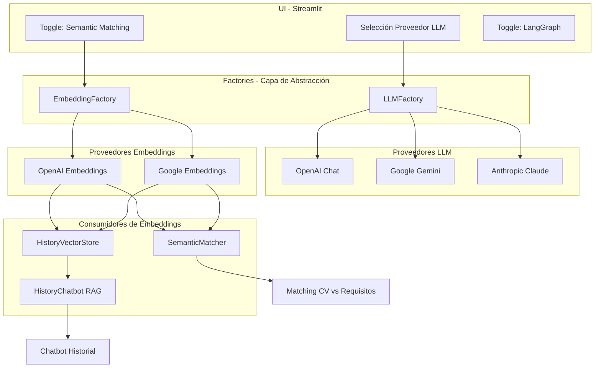
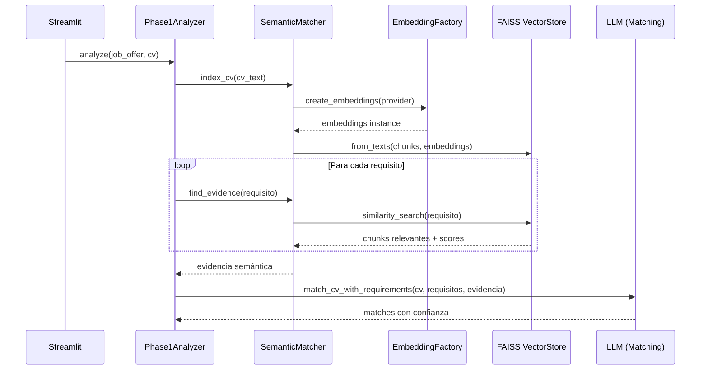
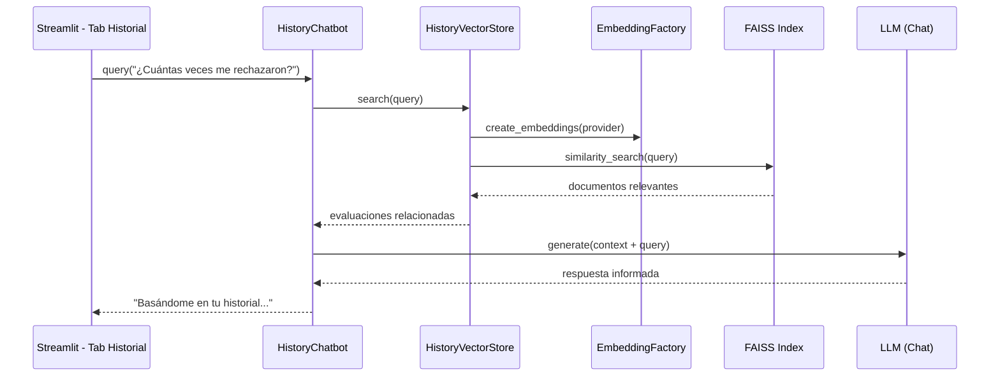
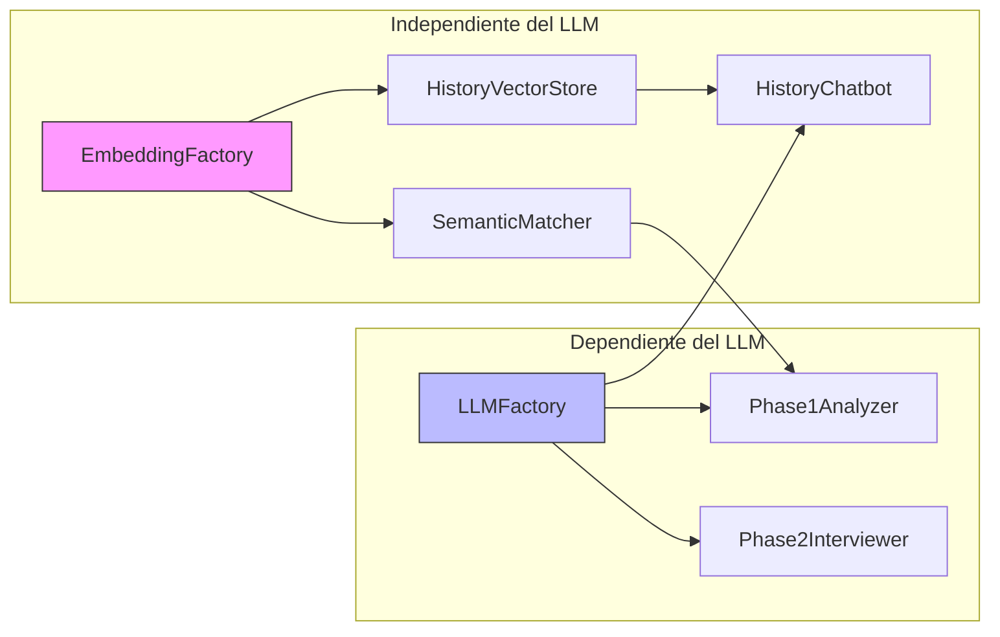

# 📊 Arquitectura de Embeddings - Velora Auto Evaluator

## Resumen Ejecutivo

Este documento detalla la arquitectura completa de embeddings del sistema, explicando cómo funcionan, qué procesos los utilizan, y cómo interactúan con la selección de proveedores LLM.

---

## ⚠️ Punto Crítico: Independencia LLM vs Embeddings

### Respuesta Directa a la Pregunta

> **¿Qué sucede si selecciono Google Gemini como proveedor y proporciono su API Key?**

**Respuesta:** Los embeddings y el LLM son **completamente independientes**. Puedes usar cualquier combinación:

| LLM Seleccionado | Embeddings | ¿Funciona? |
|------------------|------------|------------|
| OpenAI GPT-4 | OpenAI Embeddings | ✅ Sí |
| Google Gemini | OpenAI Embeddings | ✅ Sí (si tienes OPENAI_API_KEY) |
| Google Gemini | Google Embeddings | ✅ Sí (si tienes GOOGLE_API_KEY) |
| Anthropic Claude | OpenAI Embeddings | ✅ Sí (si tienes OPENAI_API_KEY) |

**Importante:** Si usas Gemini como LLM pero NO tienes `OPENAI_API_KEY`, debes tener `GOOGLE_API_KEY` para que los embeddings funcionen con Google.

---

## 🏗️ Arquitectura de Componentes



---

## 📦 Modelos de Embeddings Disponibles

### OpenAI (Recomendado)

| Modelo | Dimensiones | Uso Recomendado | Costo |
|--------|-------------|-----------------|-------|
| `text-embedding-3-small` | 1536 | **Default** - Balanceado | $ |
| `text-embedding-3-large` | 3072 | Alta precisión | $$$ |
| `text-embedding-ada-002` | 1536 | Anterior | $$ |

### Google

| Modelo | Dimensiones | Uso Recomendado |
|--------|-------------|-----------------|
| `models/text-embedding-004` | 768 | Default Google |
| `models/embedding-001` | 768 | Alternativa |

---

## 🔄 Flujo Completo de Embeddings

### 1. Matching Semántico CV vs Requisitos (SemanticMatcher)



**¿Cuándo se usa?**
- Solo cuando el toggle "Embeddings Semánticos" está **ACTIVADO**
- Mejora la precisión del matching al pre-filtrar información relevante del CV

### 2. RAG para Historial (HistoryVectorStore + HistoryChatbot)



**¿Cuándo se usa?**
- En la pestaña "Mi Historial" del UI
- Permite consultas en lenguaje natural sobre evaluaciones pasadas

---

## 🛡️ Estrategia de Fallback

El sistema implementa fallback automático si el proveedor seleccionado no tiene API key:

```python
# Lógica en EmbeddingFactory
def get_fallback_provider() -> Optional[str]:
    """
    Retorna un proveedor de embeddings con API key disponible.
    Orden de preferencia: openai > google
    """
    for provider in ["openai", "google"]:
        if validate_api_key(provider):
            return provider
    return None
```

**Escenarios de Fallback:**

| Proveedor Solicitado | API Keys Disponibles | Resultado |
|---------------------|---------------------|-----------|
| OpenAI | OPENAI_API_KEY ✅ | Usa OpenAI |
| Google | Solo OPENAI_API_KEY | Fallback a OpenAI |
| Google | GOOGLE_API_KEY ✅ | Usa Google |
| OpenAI | Solo GOOGLE_API_KEY | ❌ Error (OpenAI requerido) |

---

## 🔧 Variables de Entorno

```bash
# Para LLM
OPENAI_API_KEY=sk-...        # OpenAI GPT-*
GOOGLE_API_KEY=AIza...       # Google Gemini
ANTHROPIC_API_KEY=sk-ant-... # Anthropic Claude

# Para Embeddings (usan las mismas keys)
# OpenAI Embeddings: OPENAI_API_KEY
# Google Embeddings: GOOGLE_API_KEY

# Opcional: LangSmith Tracing
LANGSMITH_API_KEY=ls-...
```

---

## 📁 Estructura de Código

```
src/evaluator/
├── llm/
│   ├── factory.py           # LLMFactory - Crea instancias de LLM
│   ├── embeddings_factory.py # EmbeddingFactory - Crea embeddings
│   └── prompts.py            # Prompts para extracción y matching
├── core/
│   ├── analyzer.py           # Phase1Analyzer - Usa SemanticMatcher
│   └── embeddings.py         # SemanticMatcher - Matching CV vs Requisitos
├── rag/
│   ├── vectorstore.py        # HistoryVectorStore - FAISS para historial
│   └── chatbot.py            # HistoryChatbot - RAG conversacional
└── storage/
    └── memory.py             # EnrichedEvaluation - Datos para RAG
```

---

## 🎯 Casos de Uso

### Caso 1: Usuario con solo OpenAI API Key

```
Configuración: OPENAI_API_KEY=sk-...
LLM: OpenAI GPT-4 ✅
Embeddings: OpenAI text-embedding-3-small ✅
Semantic Matching: ✅ Funciona
RAG Historial: ✅ Funciona
```

### Caso 2: Usuario quiere usar Gemini

```
Configuración: GOOGLE_API_KEY=AIza...
LLM: Google Gemini ✅
Embeddings: Google text-embedding-004 ✅
Semantic Matching: ✅ Funciona
RAG Historial: ✅ Funciona
```

### Caso 3: Usuario con Gemini pero quiere embeddings OpenAI

```
Configuración:
  GOOGLE_API_KEY=AIza...
  OPENAI_API_KEY=sk-...

LLM: Google Gemini ✅
Embeddings: OpenAI text-embedding-3-small ✅ (Configurable)
```

### Caso 4: Usuario con Claude

```
Configuración:
  ANTHROPIC_API_KEY=sk-ant-...
  OPENAI_API_KEY=sk-... (REQUERIDO para embeddings)

LLM: Anthropic Claude ✅
Embeddings: OpenAI text-embedding-3-small ✅
(Claude no tiene embeddings propios)
```

---

## 📊 Almacenamiento de Vectores

Los vectores de embeddings se persisten en disco:

```
data/
└── vectors/
    └── {user_id}/
        ├── index.faiss    # Índice FAISS binario
        └── index.pkl      # Metadata de documentos
```

**Características:**
- Un índice por usuario
- Persistencia automática tras cada evaluación
- Recarga automática al iniciar la aplicación
- Reconstrucción automática si se añaden nuevas evaluaciones

---

## ⚡ Rendimiento

| Operación | Tiempo Típico | Notas |
|-----------|---------------|-------|
| Crear embeddings (1 chunk) | ~50ms | Depende del proveedor |
| Indexar CV (10 chunks) | ~500ms | Incluye chunking + embeddings |
| Búsqueda semántica (1 query) | ~100ms | FAISS es muy rápido |
| Indexar historial (50 evals) | ~2s | Una sola vez por sesión |

---

## 🔄 Diagrama de Dependencias



---

## ✅ Checklist de Configuración

- [ ] Tengo al menos una API key de embeddings (OPENAI_API_KEY o GOOGLE_API_KEY)
- [ ] Si uso Anthropic Claude, tengo OPENAI_API_KEY para embeddings
- [ ] El directorio `data/vectors/` tiene permisos de escritura
- [ ] El toggle "Embeddings Semánticos" está activado si quiero mejor matching

---

## 🚀 Extensibilidad

Para añadir un nuevo proveedor de embeddings:

1. Añadir import condicional en `embeddings_factory.py`
2. Agregar modelos a la lista correspondiente
3. Implementar el case en `create_embeddings()`
4. Actualizar `validate_api_key()`

```python
# Ejemplo: Añadir Cohere
try:
    from langchain_cohere import CohereEmbeddings
    COHERE_AVAILABLE = True
except ImportError:
    COHERE_AVAILABLE = False

# En create_embeddings():
elif provider_lower == "cohere":
    if not COHERE_AVAILABLE:
        raise ImportError("...")
    return CohereEmbeddings(model=embedding_model, cohere_api_key=key)
```

---

**Última actualización:** Diciembre 2024  
**Versión del documento:** 2.0

